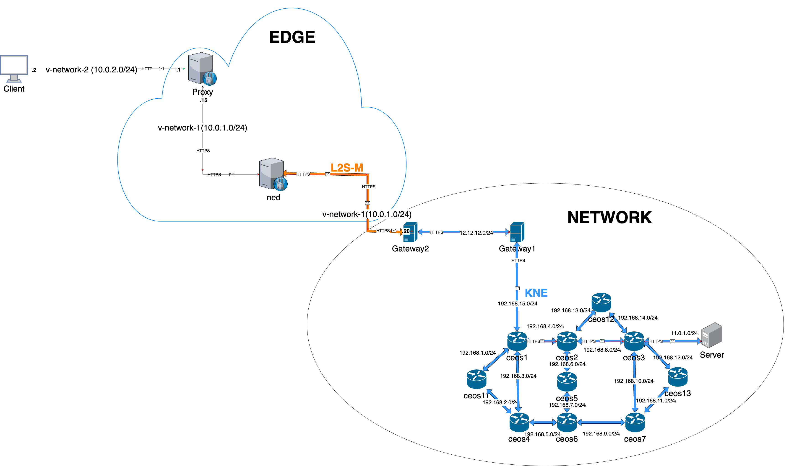

# First prototype of an integrated Network Digital Twin (NDT) including the Edge 

The technical features of the Demo deployment can be found in this repository. For this use case, the scenario is deployed on a container infrastructure using Kubernetes as the management tool.

To emulate the behavioral aspects of the transport and core network environment, KNE (Kubernetes Network Emulator by OpenConfig) has been used. Link-Layer Secure connectivity for Microservice platforms (L2S-M) is used to emulate the network edge.


# Table of Contents

- [Prerequisites](#prerequisites):
  - [KNE](#kne)
  - [L2S-M](#l2s-m)
- [Overview of the Demo](#overview-of-the-demo)
- [Demo](#demo)
- [ NDT Deployment Guide](#ndt-deployment-guide)

# Prerequisites

## KNE
### Installation

- For installing **KNE**, follow the instructions provided in the official repository: [KNE GitHub Repository](https://github.com/openconfig/kne).

### Tested Environment

This demo was tested on a 4-node cluster with the following configuration:

- **Kubernetes**: v1.27.3
- **Network Plugin**: Flannel CNI
- **Load Balancer**: MetalLB
- **Docker**: Used as the CRI. Refer to the [Docker installation guide](https://docs.docker.com/engine/install/). v20.10.21.
- **Python**: v3.8.10.
- **Go**: v1.20.1.
- **Router Images**: Arista cEOS-lab. Download the image from [Arista's software download page](https://www.arista.com/en/support/software-download).  
  The image must be converted and imported as a Docker container image.  _Tested with the cEOS-lab-4.29.2F model._

### L2S-M:
### Installation

- For installing **L2S-M**, follow the instructions provided in the official repository: [L2S-M GitHub Repository](https://github.com/Networks-it-uc3m/L2S-M/tree/main/deployments)

### Tested Environment

This demo was tested on a microK8s cluster with the following configuration:
- **Kubernetes**: MicroK8s v1.31.0 or later. _Tested on a single-node cluster._
- **Network Plugin**: Multus CNI.


# Overview of the Demo
The purpose of this demo is to showcase the first prototype of an edge-enabled Network Digital Twin, integrating two different twinning envirpnments, KNE and L2S-M, which are open-source projects. The demo involves deploying a network with a web server on the network twin infrastructure and a client at the Edge, which will make web requests to the server. Additionally, a proxy will be deployed as an edge service handling requests from the client and forwarding them to the server. The main goal is to demonstrate that secure connections can be enabled for any kind of devices, providing the secure gatweay as close to the device as required.
    
1. **Components of the NDT:**
    - **KNE:** Used to emulate the Network. 
    - **L2S-M:** Used to emulate the Edge. 

2. **Validation of the Demo**
The demo demonstrates an HTTP request sent from the client at the Edge to the web server in the network. The request passes through a reverse proxy at the Edge, which converts the HTTP request to HTTPS. Consequently, the web server uses only HTTPS, while the client at the Edge operates over HTTP, ensuring secure communication between the Edge and the network, restricting any interaction in the open to the local environment.



# Demo
## Demo Video

[](https://www.youtube.com/watch?v=-JFqwM6fy0g)


# NDT Deployment Guide
The following steps provides a guide for deploying the NDT prototype, including the Edge. Before deploying the NDT prototype, it is necessary to establish connections between the machines. Follow the steps below:

## Configuration on the Machine Hosting KNE Pods:

- #### Create a veth Pair
    Run the following commands to create a pair of virtual Ethernet interfaces:
    ```
    sudo ip link add veth2 type veth peer name veth3
    sudo ip link set veth2 up
    sudo ip link set veth3 up
    ```
 > **Note:** You must create the veth pair on the node that will host the pods of the topology.
- #### Create a VXLAN Interface
    Create a VXLAN interface with the following command, replacing <remote-ip> with the IP address of the remote host:
    ```
    sudo ip link add vxlan-1 type vxlan id 96 dev enp1s0 dstport 47 remote <remote-ip>
    sudo ip link set vxlan-1 up
    ```
- #### Create a Bridge and Add Interfaces:
    1. Install the bridge utilities package (if not already installed):
        ```
        sudo apt-get install bridge-utils
        ```
    2. Create a new bridge interface:
         ```
        sudo brctl addbr br0
         ```
    3. Add one end of the veth pair (veth2) and vxlan to the bridge:
        ```
        sudo brctl addif br0 veth2
        sudo brctl addif br0 vxlan-1
        ```
    > **Note:** 
    > 1. Only add one end of the veth pair because the other end (veth3) will be assigned to the gateway2 pod. For this demo, veth3 is already assigned in the Topology/Network/gateway2.yaml file.
    > 2.  Has been tested on a cluster created with Kubeadm. If you plan to use it with other clusters, such as Kind, additional connections may need to be added.

## Configuration on the Edge Machine:
- #### Create a VXLAN Interface
    Create a VXLAN interface with the following command, replacing <remote-ip> with the IP address of the remote host:
    ```
    sudo ip link add vxlan-1 type vxlan id 96 dev enp1s0 dstport 47 remote <remote-ip>
    sudo ip link set vxlan-1 up
    ```
    
Once you have configured the connection between the machines, you can continue with the guide to proceed with the deployment of the NDT prototype:

##  Deploy Network using KNE 

To proceed with the next steps, you should have a functional Kubernetes cluster with KNE installed and operational for topology creation. For detailed installation instructions, please refer to the official guide in the repository [KNE](https://github.com/openconfig/kne/blob/main/docs/setup.md)

#### 1. Clone this repository from the cluster controller:
```bash
git clone <repository-url>
```
#### 2. Install Ansible:
Using Ansible we have automated the deployment of the scenario. Therefore, You must have Ansible is already installed inside the machine where you want to deploy the topology If this is not the case:
```bash
sudo apt install ansible
```
#### 3. To deploy of the topology execute the `deployment.yaml` file using the following command:
```bash
ansible-playbook ~/NDT-Prototype/Topology/deployment-kne/deployment.yaml
```
#### 4. To configure the pods in the topology execute the `config.yaml` file using the following command:
```bash
ansible-playbook ~/NDT-Prototype/Topology/deployment-kne/config.yaml
```

#### 4. To delete topology execute the `undeploy.yaml` file using the following command:

```bash
ansible-playbook ~/NDT-Prototype/Topology/deployment-kne/undeploy.yaml
```

    
## Deploy Edge using L2S-M

Make sure your Kubernetes cluster is properly set up and that L2S-M is installed and operational. For comprehensive installation instructions, please refer to the official guide: L2S-M Installation Guide.

#### 1. Clone this repository from the cluster controller:
```bash
git clone <repository-url>
```
#### 2. Install Ansible:
Using Ansible we have automated the deployment of the scenario. Therefore, You must have Ansible is already installed inside the machine where you want to deploy the topology If this is not the case:
```bash
sudo apt install ansible
```
    
#### 3. To deploy of the pods execute the `deployment.yaml` file using the following command:
```bash
ansible-playbook ~/NDT-Prototype/Topology/deployment-l2s-m/deployment.yaml
```

#### 4. To start the proxy and filter packets on the corresponding interfaces for ports 80 and 443, execute the `config.yaml` file using the following command:

```bash
ansible-playbook ~/NDT-Prototype/Topology/deployment-l2s-m/config.yaml
```

#### 4. To delete pods execute the `undeploy.yaml` file using the following command:

```bash
ansible-playbook ~/NDT-Prototype/Topology/deployment-l2s-m/undeploy.yaml
```


